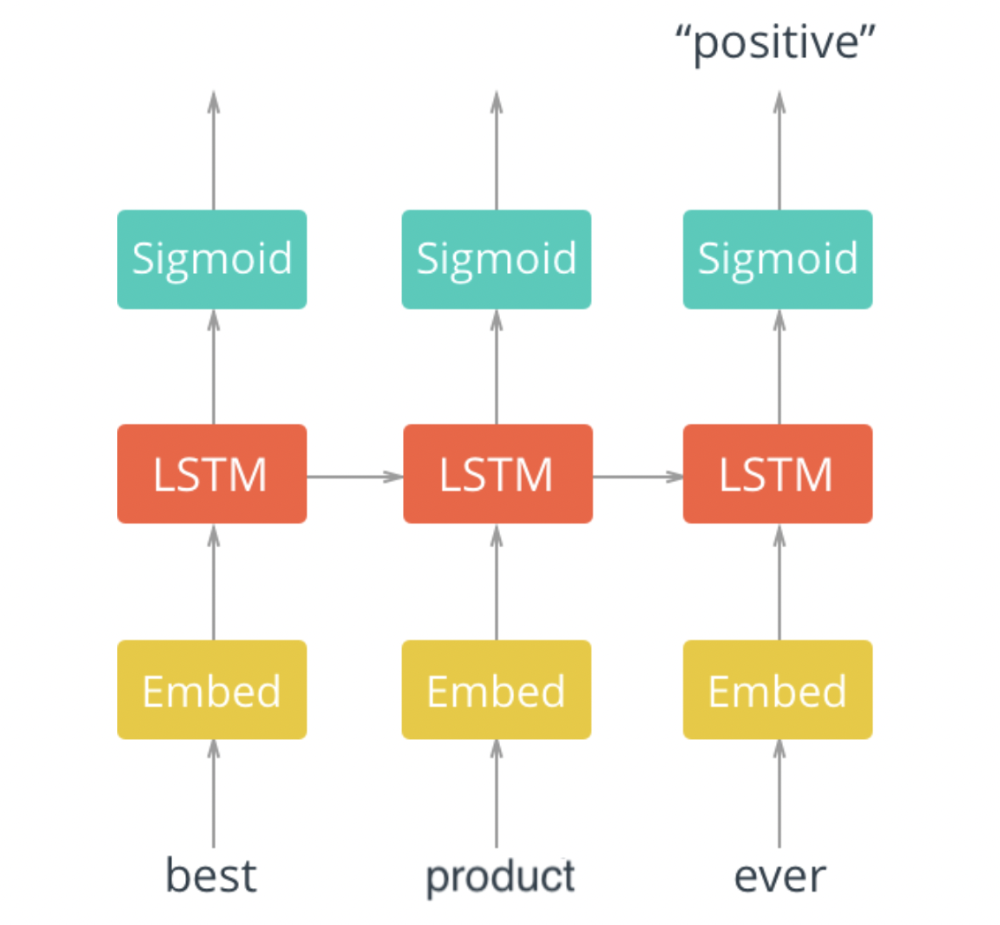

<h1 align="center">LSTM-for-Sentiment-Analysis</h1>

## About the project

In this notebook, I implemented a recurrent neural network (Long short-term memory) using PyTorch that performs sentiment analysis.

Here I used a dataset of Amazon baby products reviews, accompanied by product names and rates. You can find it [here](https://www.kaggle.com/ronnie3rg/amazon-baby-sentiment-analysis)


#### Network Architecture

The architecture for this network is shown below.



The layers are as follows:

1. An embedding layer that converts our word tokens (integers) into embeddings of a specific size.

2. An LSTM layer defined by a hidden_state size and number of layers

3. A fully-connected output layer that maps the LSTM layer outputs to a desired output_size

4. A sigmoid activation layer which turns all outputs into a value 0-1; return only the last sigmoid output as the output of this network.


___

**It is not possible to push model's 	`state_dict` here due to its size. If you need it, feel free to [contact](#contact) me.**
## Getting Started

### Dataset

It's a `CSV` file consisting of reviews of Amazon baby products. You can download it from [`Kaggle`](https://www.kaggle.com/datasets/ronnie3rg/amazon-baby-sentiment-analysis?select=amazon_baby.csv). It consists of product names, reviews, and ratings associated with each. Bellow, you can see dataframe info:


|Data columns (total 3 columns):|||
| ----- | ----- | ----- |
|name   |183213 non-null |object|
|review |182702 non-null |object|
|rating |183531 non-null |int64|

Head of the data:


|name|	review|	rating|
|---|---|---|
|Planetwise Flannel| Wipes	These flannel wipes are OK, but in my opinion ...|	3
|Planetwise Wipe Pouch|	it came early and was not disappointed. i love...|	5
|Annas Dream Full Quilt with 2 Shams|	Very soft and comfortable and warmer than it l...|	5
|Stop Pacifier Sucking without tears with Thumb...|	This is a product well worth the purchase. I ...|	5
|Stop Pacifier Sucking without tears with Thumb...|	All of my kids have cried non-stop when I trie...|	5


### Steps 


1. Clone the repo
   ```sh
   git clone https://github.com/salehsargolzaee/LSTM-for-Sentiment-Analysis  
   ```

2. Make sure you've installed following packages:
	* PyTorch
	* Pandas
	* NumPy
	
3. Change directory to repo folder
   ```sh
   cd path/to/repo/folder
   ```
4. Download the [`amazon_baby.csv`](https://www.kaggle.com/datasets/ronnie3rg/amazon-baby-sentiment-analysis?select=amazon_baby.csv) dataset, and place it in this project's home directory, at the location `data/amazon_baby.csv`.


5. Run `jupyter notebook`
    
   ```sh
   jupyter notebook
   ```
6. Open `Sentiment_RNN_product_review.ipynb`


## Contact 
<a id = "contact"></a>

Saleh Sargolzaee - [LinkedIn](https://www.linkedin.com/in/saleh-sargolzaee) - salehsargolzaee@gmail.com

Project Link: [https://github.com/salehsargolzaee/LSTM-for-Sentiment-Analysis](https://github.com/salehsargolzaee/LSTM-for-Sentiment-Analysis)

<p align="right">(<a href="#top">back to top</a>)</p>

## :man_astronaut: Show your support

Give a ⭐️ if you liked the project!


